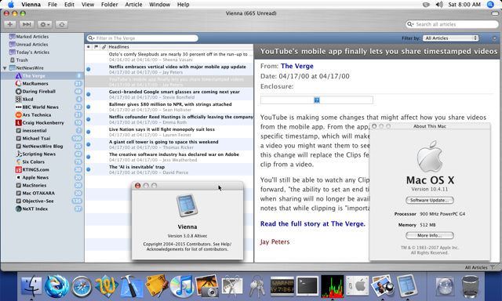
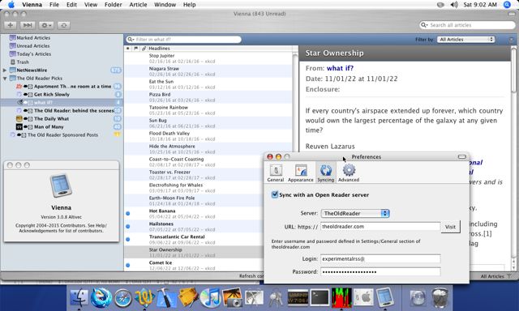

# Vienna 3.0.8 Altivec

| Vienna 3 on Tiger | Vienna 3 Sync on Tiger |
|--|--|
|[](./README/README.1.png)|[](./README/README.2.png)|

## About

[Vienna 3](https://github.com/ViennaRSS/vienna-rss) is the first version of the 
RSS reader that supports syncing with any online services like 
[The Old Reader](https://theoldreader.com). However, 3.0.x+ requires Mac OS X
10.6 Snow Leopard and later. I wanted this backport so I could use an RSS
reader with The Old Reader syncing for my iMac G4 which cannot run Snow Leopard.

This backport also replaces the underlying RSS Feed and Account syncing 
networking code with modern libcurl and OpenSSH which supports TLS 1.2.
This means, that you are no longer limited by the networking limitations of the
legacy version of Mac OS X you are running.

This backport project is powered by [Altivec Intelligence](https://github.com/jeffreybergier/AltivecIntelligence) 
to allow easy cross-compiling for Mac OS X Tiger.

### Technical Details

| Area | Change |
|---|---|
| Minimum OS | 10.4 Tiger |
| Architectures | `ppc` + `i386` fat binary |
| Networking | `ASIHTTPRequest` re-plumbed to use **libcurl** with bundled CA bundle — enables TLS 1.2 against modern servers (CFNetwork on Tiger/Leopard cannot) |
| Concurrency | Fast enumeration, blocks, and `NSOperationQueue` replaced with Tiger-compatible equivalents |
| Dependencies | `PSMTabBarControl` bundled as a `.framework`; `JSONKit`, `SQLite`, `libcurl`, `libssl`, `libz` statically linked |
| Compatibility shims | Runtime-checked API bridges centralized in `src/custom/CrossPlatform.{h,m}` and injected via `-include` |

### Known Issues

- Networking and/or Database activity happens on main thread so usually beachballs when syncing
- Copy and Paste do not work (this is bizarre)
- WebView uses system networking, not libcurl

### ToDo List

- [ ] Investigate beachball on sync
- [ ] Convert nib files to code
- [ ] Add x86_64 and arm64 builds
- [ ] Create release builds with Github Actions

## For Developers

### Repository layout

```
vienna/            git submodule — upstream source, NEVER modified
deps/              external dependencies (JSONKit, PSMTabBarControl) — NEVER modified
patches/           unified diffs applied against vienna/ and deps/
src/
  custom/          files authored for this project (CrossPlatform, etc.)
  nibs/            custom nib builders
  resources/       custom .tiff / .plist / .pem
  scripts/         build/stage/patch shell scripts
build-stage/       generated staging area (patched copies) — do not edit in place
altivec/           toolchain submodule (osxcross, libcurl, deploy script)
```

### Prerequisites

You do **not** need a Mac. The build system is [Altivec Intelligence](https://github.com/jeffreybergier/AltivecIntelligence) 
which distributes a preconfigured Docker container with the [osxcross](https://github.com/tpoechtrager/osxcross) 
toolchain targeting the 10.5 SDK with a 10.4 deployment target.

- Docker + Docker Compose
- `git` with submodule support
- ~5 GB free disk for the toolchain image

### First-time setup

```bash
git clone git@github.com:jeffreybergier/Vienna-Altivec.git
cd vienna-altivec
git submodule update --init --recursive
docker compose build # 5-20 min
docker compose run --rm altivec "cd ./altivec/libs/libcurl && make mac" # 5-90 min
```

### Building

All build commands run inside the container. The below command makes a release
build.

```bash
docker compose run --rm altivec "make stage && make release"
```

Note: The build command produces many warnings with regard to property syntax
and fast enumeration. These warnings can be ignored because there are runtime
patches to support these features even on Tiger.

The other available commands

```bash
make stage          # apply patches into build-stage/
make debug          # compile a debug fat binary → build-debug/Vienna.app
make release        # compile a release build
make patches        # updates patch files based on changes in build-stage
make clean          # wipe build artifacts
```

### Deploying to a real Mac

If you have a vintage Mac accessible over SSH, the helper script copies
the built bundle and launches it:

```bash
./altivec/altivec_deploy.sh build-debug -d <ssh-host>
```

Replace `<ssh-host>` with the host alias in your `~/.ssh/config`.

### Editing workflow

#### Changing a file in `vienna/` or `deps/` (patch workflow)

`build-stage/` is regenerated on every `make stage`, so changes there are
ephemeral until you run `make patches` to persist them as unified diffs.

```bash
make stage
$EDITOR build-stage/source/SomeFile.m   # edit the staged copy
make patches                            # diff build-stage/ back into patches/
make debug
```

#### Changing a file in `src/`

```bash
$EDITOR src/custom/CrossPlatform.m
make debug
```

No staging step needed — `src/` files are compiled directly.

### Common pitfalls

- **Forgetting `make patches` after editing `build-stage/`** — changes are lost on the next `make stage`.
- **Editing `build-stage/` before running `make stage`** — the directory may be empty or out of date.

## License

Vienna itself is Apache 2.0 — see `vienna/LICENSE`. The Altivec build
scripts and patches in this repository are released under the same terms.
